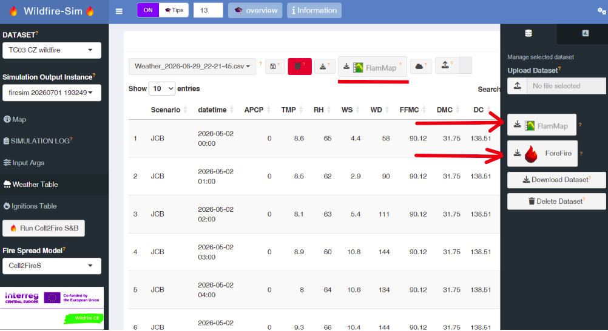

<!-- badges: start -->

[](https://lifecycle.r-lib.org/articles/stages.html#experimental)
[](https://opensource.org/licenses/MIT)

[](https://github.com/fpirotti/Cell2FireR/actions/workflows/R-CMD-check.yaml)

<!-- badges: end -->

# Cell2FireR: R bindings and platform for Fire Spread Simulations using Cell2Fire

Cell2FireR not only provides a bindings to Cell2Fire, but also provides
a portal with tools to load and validate weather/land-cover data,
manually insert ignition points and run fire simulation using Cell2Fire
directly on the portal.

It also provides tools to extract aligned data formatted correctly for
running FARSITE and ForeFire software locally.



## Installation

Grab the latest version from GitHub then run the interactive app, or
keep reading.

``` r
remotes::install_github("fpirotti/Cell2FireR")
library(Cell2FireR)
Cell2FireR::runWildfireApp()
```

## Description

Installing this package provides two main elements:

-   R bindings to the [Cell2Fire](https://github.com/fire2a/C2F-W)
    software, a Cell Based Forest Fire Growth Model.
-   an online graphical user interface for learning how to use the fire
    behaviour software.

The R bindings allow users to modify input arguments and run the
simulation inserting arguments and pipelining call to the Cell2Fire
executable and interpret the outputs converting them to maps and plots.

# Cell2Fire R Wrapper (`run_cell2fire.R`)

This R script provides a high-level wrapper function, `run_cell2fire()`,
designed to automate the preparation and execution of the **Cell2Fire**
wildfire spread simulator. It handles directory management, coordinate
transformation for ignition points, raster data validation, and
command-line argument construction.

------------------------------------------------------------------------

## Overview

The `run_cell2fire` function acts as a bridge between R and the
Cell2Fire C++ executable. It automates several tedious steps: \*
**Workspace Management**: Creates timestamped instance and result
directories for every run. \* **Data Preparation**: Links or copies
required landscape rasters (Fuel, Elevation, Slope, etc.) into a
standardized format for the simulator. \* **Auto-Conversion**: Detects
if fuel rasters are not in the required 32/64-bit format and converts
them to `INT4U` automatically. \* **Spatial Alignment**: Automatically
transforms ignition point coordinates to match the Coordinate Reference
System (CRS) of the fuel raster.

------------------------------------------------------------------------

## 🛠 Parameters

### Core Inputs

| Parameter | Description |
|:-----------------------------------|:-----------------------------------|
| `fuel` | **Required**. Path to the fuel model raster. |
| `fuel_model` | **Required**. String specifying the model logic. It can be provide either by string or single character according to the lookup table below. "0. Scott & Burgan" = "S", "1. Kitral" = "K", "2. Canada FBP" = "C", "3. Portugal" = "P" also an heuristic check for key words is done to look for the fuel model to use. |
| `out_folder` | Base directory where simulation instances will be stored. |
| `input_folder` | Directory containing rasters in asc or tif format with the following possible rasters |

If the 'fuels' raster file is in `tif` format, then it assumes all other
rasters are also in that format. Otherwise, it assumes `ascii` format.

-   elevation: terrain elevation [m]
-   saz: slope azimuth
-   slope: terrain slope
-   cur: curing level
-   cbd: canopy bulk density [kg/m3]
-   cbh: canopy base height [m]
-   ccf: canopy cover fraction
-   probabilityMap: ignition probability map [%]
-   fmc: foliage moisture content
-   hm: tree height [m]

### Landscape & Topography

-   `elevation`, `slope`, `saz` (Azimuth), `cur` (Curvature): Paths to
    topographic rasters.
-   `firebreaks`: Path to a raster defined where fire cannot spread.

### Canopy Data (Crown Fire)

-   `crown`: Boolean. If `TRUE`, the simulator includes crown fire
    logic.
-   `cbh`, `cbd`, `ccf`, `hm`: Paths to canopy base height, bulk
    density, cover fraction, and height model rasters.

### Weather & Ignition

-   `weather_mode`: Supports "Single weather file" or "Multiple
    weathers".
-   `ignition_mode`: Supports "Probability map" or "Single points on a
    Layer" (via CSV or Shapefile).

### PLEASE TAKE NOTE

If you specify an `--input-instance-folder`, you do not need to provide
a separate path for the topography, fuel and canopy rasters, but the
files inside that folder must be named exactly as the following and be
either in GeoTiff (.tif) or [ESRI ASCII
format](https://gdal.org/en/stable/drivers/raster/aaigrid.html) (.asc):

-   fuels.tif(.asc)
-   elevation.tif(.asc)
-   slope.tif(.asc)
-   saz.tif(.asc)
-   cur.tif(.asc)
-   cbh.tif(.asc)
-   cbd.tif(.asc)
-   ccf.tif(.asc)
-   hm.tif(.asc)
-   fcc.tif(.asc) - forest canopy cover

------------------------------------------------------------------------

## Usage

### Basic Example

``` r
source("run_cell2fire.R")

sim_results <- run_cell2fire(
    fuel = "data/fuels.tif",
    fuel_model = "0. Scott & Burgan",
    input_folder = "data",
    out_folder = "sim_runs", 
    elevation = "data/dem.tif",
    nsims = 10,
    sim_threads = 4
)
```

### Return Object

The function returns a named list containing: \* `process`: The active
`processx` object (handling the background C++ execution). \* `command`:
The full path to the binary used. \* `args`: The character vector of CLI
arguments passed to Cell2Fire. \* `outputFolder`: Path to the specific
results directory for this run.

------------------------------------------------------------------------

## Simulation Logic Details

1.  **Fuel Data Validation**: The script checks the data type of the
    fuel raster. If it is less than 32-bit, it warns the user and
    creates a compatible `_INT4U` version.
2.  **Lookup Tables**: Based on the `fuel_model` selected, the script
    automatically picks the corresponding lookup table (e.g.,
    `spain_lookup_table.csv`, `fbp_lookup_table.csv`) from the template
    directory.
3.  **Weather Handling**: If no weather file is provided in "Single"
    mode, it copies a generic default `Weather.csv` to ensure the
    simulation doesn't fail.
4.  **Dry Run Mode**: Setting `dry = TRUE` allows you to validate your
    inputs and see the exact command line string that *would* be
    executed without actually starting the simulation.

## Usage

In order to run the simulator and process the results, the following
command can be used:

-   via Rscript call

```         
Rscript -e "Cell2FireR::run_cell2fire()" --input-instance-folder ../data/Sub40x40/ --output-folder ../Sub40x40 --ignitions 1 --sim-years 1 --nsims 10 --grids --finalGrid --weather rows --nweathers 1 --Fire-Period-Length 1.0 --output-messages --ROS-CV 0.8 --seed 123 --stats --allPlots --IgnitionRad 1
```

-   directly

```         
library(Cell2FireR)

# Example wrapper or user call
template_location <- system.file("templates", package = "Cell2FireR")

# Choose binary based on OS automatically... or assign path of Cell2Fire to 
# bin_location variable
# 
# if (.Platform$OS.type == "windows") {
#   bin_location <- system.file("bin", "C2F", "Cell2Fire.exe", package = "Cell2FireR")
# } else {
#   bin_location <- system.file("bin", "C2F", "Cell2Fire", package = "Cell2FireR")
# }

bin_location <- "path to your cell2fire executable downloaded from https://github.com/fire2a/C2F-W/releases"
# Run the simulator
process_obj <- run_cell2fire(
  fuel = "path/to/fuel.tif",
  fuel_model = "0. Scott & Burgan",
  input_folder = "path/to/inputs",
  out_folder = "path/to/outputs",
  elevation = "path/to/elevation.tif",
  c2f_bin_path = bin_location,
  template_dir = template_location
)

# You can now monitor `process_obj` using processx methods like:
process_obj$process$wait()
process_obj$process$read_output_lines()

```

For the full list of arguments and their explanation use:

```         
run_cell2fire()
```

## Web app

An embedded web app is available in the folder `inst/app`. It allows
interactive insertion of ignition points, weather data etc.. and other
input arguments. Users can install in their own PC or in HPC servers
with multiple processors thus taking advantage from parallel processing
capabilities of [Cell2Fire](https://github.com/fire2a/C2F-W).

```         
shiny::runApp('inst/app')
```

Uploading user data can be done with a files inside a Zipped archive.
The name of the ZIP archive will be the one used for storing and viewing
the specific dataset. Fuel and canopy files should be stored directly in
the archive, without subfolders.

See a typical dataset to upload using the [FIRE-RES Pan-European Fuel
Map Server](https://www.cirgeo.unipd.it/fire-res/app/) platform for 100
m resolution maps or try one from the [direct link
HERE](https://www.cirgeo.unipd.it/FIRE-RES/ITC34/ITC34.zip)


## Acknowledgements

This work was supported by the [Wildfire CE project "Fighting wildfires
better together across borders" Interreg Central
Europe](https://www.interreg-central.eu/projects/wildfire-ce/).

[](https://www.interreg-central.eu/projects/wildfire-ce/)

==\> Many parts were taken from the excellent development and
implementation of the QGIS plugin from the [Fire Management & Advanced
Analytics group](https://github.com/fire2a).

## References

"Cell2Fire: A Cell-Based Forest Fire Growth Model to Support Strategic
Landscape Management Planning"

by Cristóbal Pais, Jaime Carrasco, David L. Martell, Andres Weintraub,
and David L. Woodruff (published in Frontiers in Forests and Global
Change, 2021).
