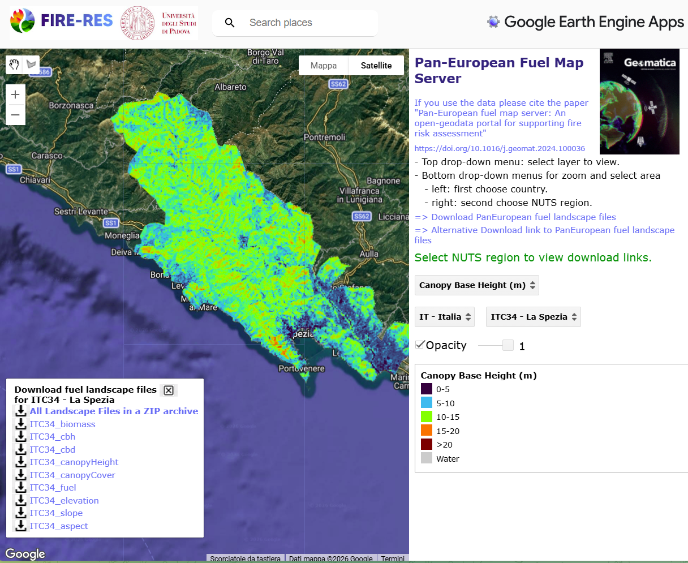

# Cell2FireR: R bindings for Cell2Fire -

## Description

R bindings to the [Cell2Fire](https://github.com/fire2a/C2F-W) software,
a Cell Based Forest Fire Growth Model. It also provides an online
graphical interface for learning how to use a wildfire behaviour
software.

The R bindings allow users to modify input arguments and run the
simulation inserting arguments pipelining the testing of single-argument
on the final results.

## Usage

In order to run the simulator and process the results, the following
command can be used:

-   via Rscript call

```         
Rscript -e "Cell2FireR::cell2fire_run()" --input-instance-folder ../data/Sub40x40/ --output-folder ../Sub40x40 --ignitions 1 --sim-years 1 --nsims 10 --grids --finalGrid --weather rows --nweathers 1 --Fire-Period-Length 1.0 --output-messages --ROS-CV 0.8 --seed 123 --stats --allPlots --IgnitionRad 1
```

-   via direct

```         
library(Cell2FireR)

cell2fire_run(c("--input-instance-folder", "../data/Sub40x40/",
                "--output-folder", "../Sub40x40", 
                "--ignitions", "1"
                "--sim-years", "1"))
```

For the full list of arguments and their explanation use:

```         
cell2fire_run()
```

## Web app

An embedded web app is available in the folder `inst/app`. It allows
interactive insertion of ignition points, weather data etc.. and other
input arguments. Users can install in their own PC or in HPC servers
with multiple processors thus taking advantage from parallel processing
capabilities of [Cell2Fire](https://github.com/fire2a/C2F-W).


```         
shiny::runApp('inst/app')
```

Uploading user data can be done with a files inside a Zipped archive.
The name of the ZIP archive will be the one used for storing and viewing
the specific dataset. Fuel and canopy files should be stored directly in
the archive, without subfolders.

See a typical dataset to upload using the [FIRE-RES Pan-European Fuel
Map Server](https://www.cirgeo.unipd.it/fire-res/app/) platform for 100
m resolution maps or try one from the [direct link
HERE](https://www.cirgeo.unipd.it/FIRE-RES/ITC34/ITC34.zip)




## Acknowledgements

This work was supported by the [Wildfire CE project "Fighting wildfires
better together across borders" Interreg Central
Europe](https://www.interreg-central.eu/projects/wildfire-ce/).
[{width="400"}](https://www.interreg-central.eu/projects/wildfire-ce/)
